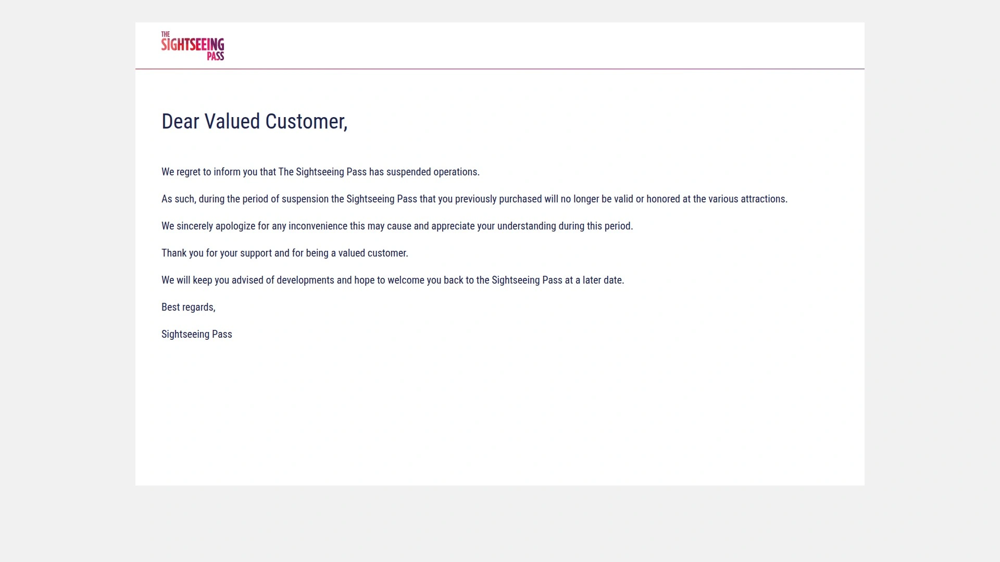
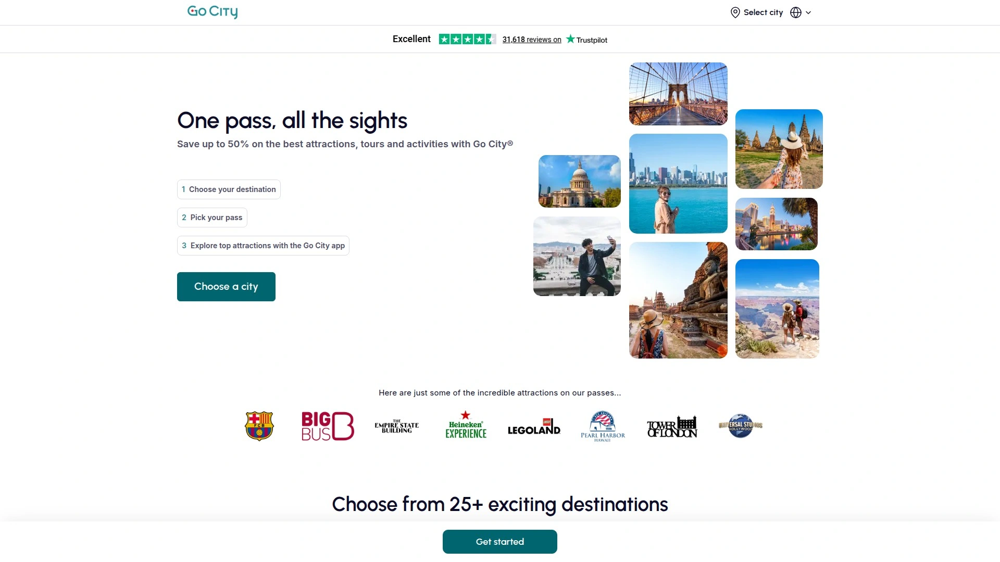
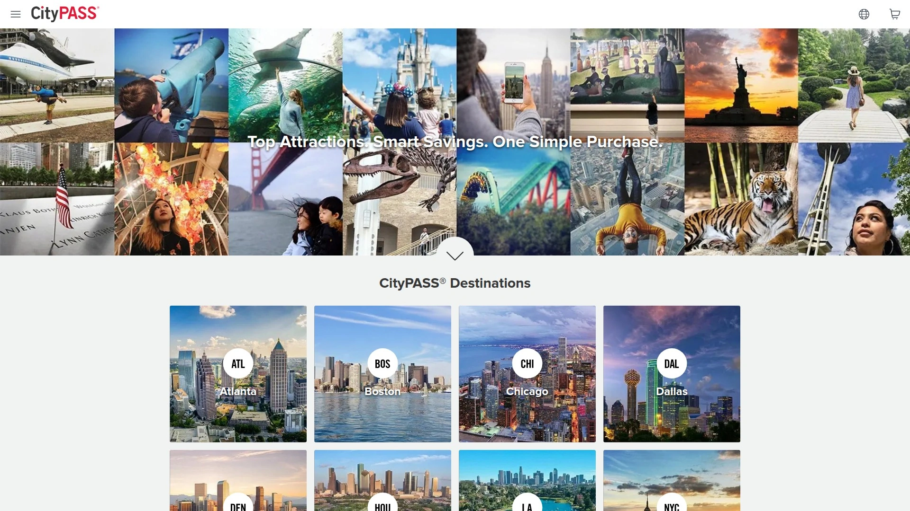
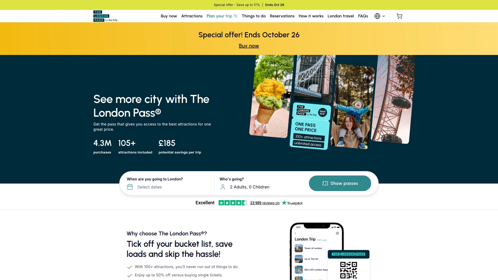
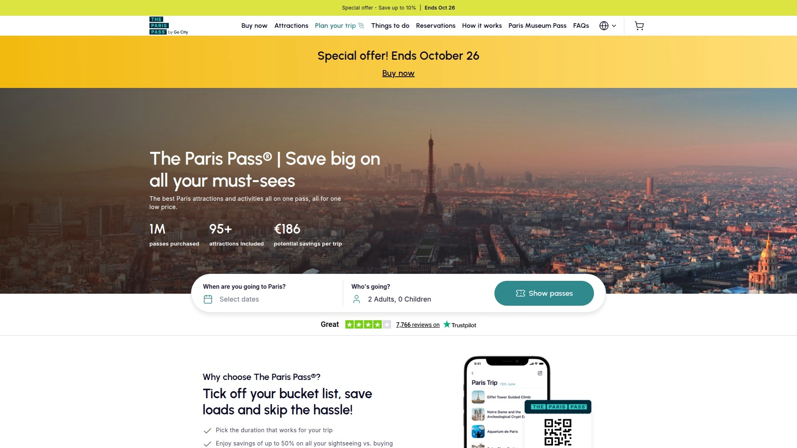
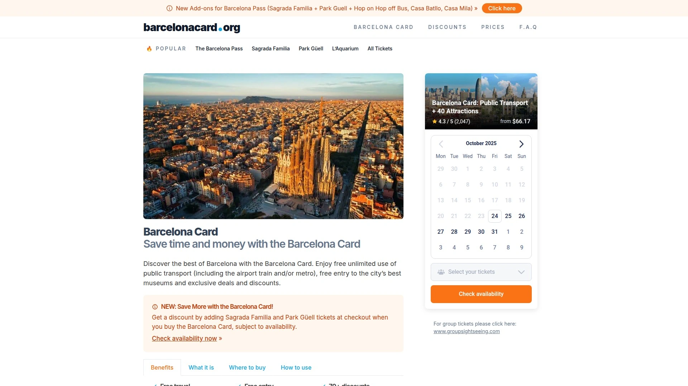
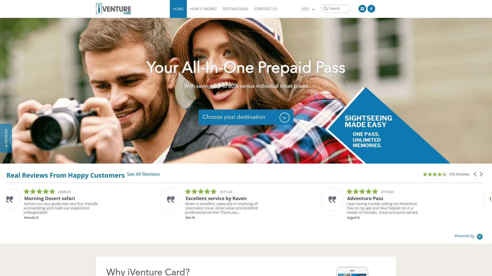
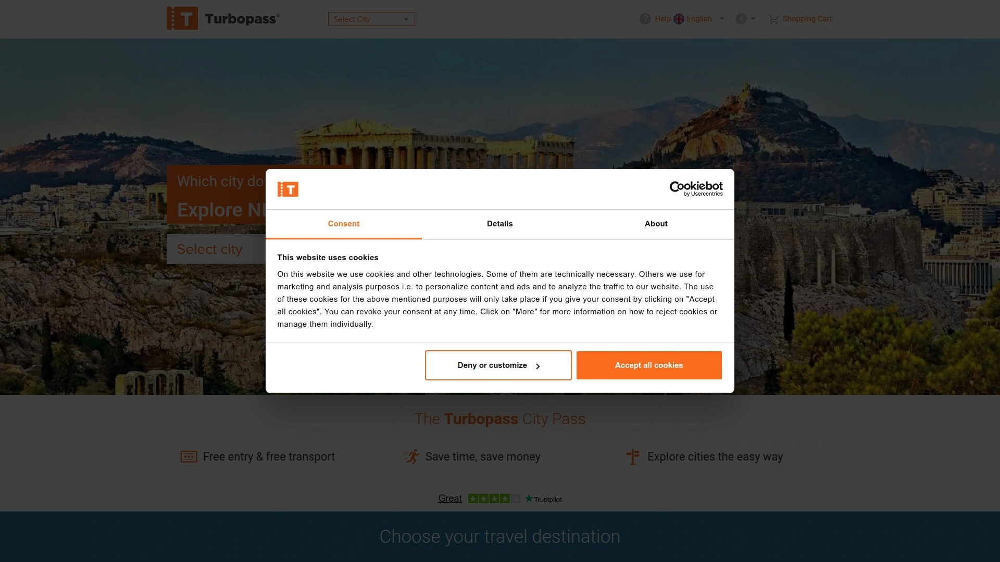

# 2025's Top 8 Best Tourist Attraction Passes

Visiting major cities and paying full price at every museum, observation deck, and tour feels like hemorrhaging cash—$35 here for a museum, $45 there for a skyline view, another $50 for a boat tour until you've blown $500 without realizing it. Tourist attraction passes solve this by bundling admission to dozens of sights into single prepaid cards saving 30-50% compared to individual tickets while eliminating ticket lines at popular attractions. Modern city passes offer flexible options from unlimited consecutive-day access to attraction-based credits spreading visits across weeks rather than forcing exhausting marathon sightseeing.

Whether you're planning action-packed weekends hitting every major landmark or leisurely multi-week trips exploring hidden gems alongside tourist classics, these platforms transform expensive city visits into affordable adventures. The best passes combine major attractions worth hundreds in regular admission with mobile convenience, skip-the-line privileges, and validity periods accommodating both frantic tourists and relaxed explorers. Travelers report recouping pass costs after just 2-3 attractions, turning remaining visits into pure savings while enjoying stress-free entry without fumbling for wallets at every location.

## **[Sightseeing Pass](https://sightseeingpass.com)**

Flexible attraction pass system offering comprehensive city coverage with skip-the-line benefits.

Sightseeing Pass established itself as flexible option in tourist pass market providing access to numerous attractions across major destinations. The platform emphasized user choice allowing travelers to select passes matching their specific sightseeing styles and schedules. This customization approach accommodated both intensive tourists wanting to maximize daily attractions and leisurely visitors spreading experiences across longer periods.

**Core value proposition centered on flexibility:** Travelers appreciated ability to choose pass types fitting their unique travel patterns rather than being forced into rigid structures. The system supported various durations and attraction counts letting users optimize value based on actual planned activities. Skip-the-line access at participating attractions eliminated frustrating waits at popular sights during peak seasons.

Mobile pass functionality enabled convenient digital access eliminating physical card handling. Tourists displayed passes on smartphones at attraction entrances streamlining entry processes. This digital-first approach particularly benefited international travelers avoiding physical pickup requirements at destination collection points.

Competitive pricing positioned Sightseeing Pass as value option compared to higher-priced alternatives. The platform's pricing structure aimed at delivering savings while maintaining broad attraction coverage. Transparent comparison tools helped travelers calculate potential savings based on their specific itineraries.

While Sightseeing Pass has suspended operations, the platform demonstrated how flexible pass structures serve diverse traveler needs. For travelers who valued customization and comprehensive attraction access, Sightseeing Pass provided adaptable solutions fitting various visit styles.

## **[Go City](https://gocity.com)**

Leading flexible pass platform offering All-Inclusive and Explorer options across 25+ global cities.

Go City dominates the modern attraction pass market serving travelers in over 25 cities worldwide including major US destinations and international hotspots. The platform operates two distinct pass types—All-Inclusive for consecutive-day unlimited access and Explorer for attraction-count-based flexibility. This dual approach accommodates both intensive tourists cramming maximum sights into short trips and leisured visitors spacing attractions comfortably.

All-Inclusive passes work on consecutive-day basis letting you visit unlimited attractions over 1, 2, 3, 4, 5, 7, or 10 days. This structure suits aggressive sightseers wanting to maximize value by hitting multiple attractions daily. Travelers using this option report visiting 6+ attractions per day though the pace feels rushed requiring early starts and strategic planning.

**Explorer Pass provides leisurely alternative:** Choose 2, 3, 4, 5, 6, 7, or 10 attractions valid for 30-60 days from first use. This extended validity removes pressure to cram everything immediately, letting you spread visits across weeks or return on multiple trips. The Explorer model particularly suits travelers with longer stays, multiple city visits, or those prioritizing quality experiences over quantity.

Attraction selection exceeds competitors significantly—major cities feature 80-100+ participating venues including top museums, observation decks, boat tours, theme parks, and unique local experiences. This extensive inventory ensures something appeals to every interest from art enthusiasts to thrill-seekers. Popular inclusions feature Empire State Building, Top of the Rock, Statue of Liberty, major aquariums, and hop-on-hop-off bus tours.

Mobile app delivers complete pass functionality with QR code scanning at attraction entries. Make reservations for time-specific attractions directly through the app avoiding separate booking hassles. Price tracking shows real-time savings calculations helping you understand whether you're maximizing pass value.

Testing reveals Go City frequently delivers better pricing than competitors while offering more attraction choices. Sample calculations show savings of 27-39% compared to individual ticket purchases depending on selected attractions. For travelers wanting maximum flexibility with extensive attraction options, Go City represents best overall value in the market.

## **[CityPASS](https://www.citypass.com)**

Curated fixed-bundle passes featuring top-tier attractions in 15 North American cities.

CityPASS pioneered the attraction pass concept and maintains strong position through curated approach emphasizing quality over quantity. Operating in 15 major US and Canadian cities, the platform focuses on premier attractions rather than overwhelming choice. Each city's CityPASS typically includes 5-6 must-see venues—some fixed, others your choice from limited selections.

The simplified structure appeals to first-time visitors wanting straightforward access to iconic landmarks without decision paralysis. New York CityPASS for example includes Empire State Building and American Museum of Natural History automatically, then lets you choose 3 more from just 6 options. This curated approach ensures you hit highlights without overthinking itinerary planning.

**Savings and convenience benefits:** CityPASS consistently delivers 40-50% savings compared to individual ticket prices at included attractions. The focused attraction list means fewer choices but guaranteed top-tier experiences. Most passes remain valid 9 consecutive days from first use providing reasonable flexibility for typical tourist visits.

Expedited entry lanes at many attractions let CityPASS holders bypass general admission lines. This skip-the-line access proves particularly valuable at perennially crowded sites like observatories and aquariums during peak summer months. Mobile ticketing through official app eliminates physical booklet handling modernizing the traditional pass experience.

CityPASS works best for tourists with 3-5 day city visits wanting to efficiently hit major landmarks. The preset bundle structure removes planning complexity making it ideal for families and first-timers. Drawbacks include limited attraction variety—if bundled sights don't interest you, alternative passes offering broader choice deliver better value.

Pricing sits in mid-range typically $100-150 for adult passes depending on city. This positions CityPASS affordably while maintaining premium attraction access. For straightforward sightseeing hitting top attractions without extensive research, CityPASS delivers reliable value.

## **[The London Pass](https://londonpass.com)**

Comprehensive London attraction pass with 80+ venues plus optional transportation add-on.

The London Pass provides access to over 80 London attractions including Tower of London, Westminster Abbey, Thames river cruises, and top museums. This extensive coverage spans historic landmarks, modern entertainment, guided tours, and unique experiences throughout the capital. The pass operates on consecutive-day basis available in 1, 2, 3, 4, 5, 6, 7, or 10-day durations.

Skip-the-line privileges at major attractions help you avoid notorious London queues particularly during summer tourist season. Tower of London and other crown jewel sites often feature 60+ minute waits that pass holders bypass entirely. This time-saving proves as valuable as financial savings when maximizing limited vacation days.

**Optional transportation integration:** Add Oyster travel card covering London Underground, buses, and trams for complete mobility solution. This bundling simplifies logistics eliminating separate transit planning and ticketing. However, transportation remains optional add-on rather than automatic inclusion allowing budget-conscious travelers to skip if using alternative arrangements.

Mobile digital pass eliminates physical card pickup requirements streamlining arrival logistics. Download pass to smartphone and present QR codes at attraction entrances. Some attractions require advance reservations made through companion app or website.

The London Pass competes directly with iVenture Card, Turbopass London City Pass, and Go City London in crowded market. Comparative advantage lies in attraction breadth and strong skip-the-line access at premium venues. Pricing reflects this premium positioning though aggressive sightseers visiting 3-4 attractions daily easily recoup costs.

For tourists planning intensive London sightseeing hitting major paid attractions, The London Pass delivers comprehensive coverage with valuable time-saving benefits.

## **[Paris Pass](https://www.parispass.com)**

All-in-one Paris pass combining attraction entry, museum access, and transportation.

Paris Pass bundles over 60 Paris attractions, museums, and tours into single pass with integrated public transportation. Iconic inclusions span Louvre, Versailles, Arc de Triomphe, river cruises, and hop-on-hop-off bus tours. The comprehensive structure suits first-time Paris visitors wanting complete city access without multiple separate passes.

Consecutive-day structure offers 2, 3, 4, or 6-day options matching typical Paris visit lengths. Unlike some competitors requiring pass activation at first attraction, Paris Pass activates based on selected start date providing planning certainty. This date-certain approach helps travelers coordinate schedules and reservations confidently.

**Museum pass integration proves particularly valuable:** Paris museums charge €15-20 individual entry quickly accumulating to hundreds for art enthusiasts. The bundled museum access through Paris Museum Pass component covers major institutions and smaller specialty museums. Skip-the-line entry at museums and monuments saves hours during peak tourist seasons when Louvre lines stretch multiple city blocks.

Transportation component includes Paris metro, buses, and RER trains within central zones. This travelcard functionality eliminates per-ride ticket purchases and complex zone calculations confusing visitors unfamiliar with Paris transit. Airport RER transfers to central Paris included in some pass tiers.

Paris Pass commands premium pricing reflecting comprehensive all-in-one structure. Budget-conscious travelers visiting fewer attractions may find à la carte tickets or museum-only passes more economical. However, intensive sightseers easily justify costs through included transportation and extensive attraction access.

For first-time Paris visitors wanting comprehensive worry-free access to major sights plus transportation convenience, Paris Pass delivers complete solution despite premium pricing.

## **[Barcelona Card](https://www.barcelonacard.org)**

Official Barcelona tourist pass emphasizing museums, public transportation, and cultural venues.

Barcelona Card operates as official city tourist pass run by Barcelona tourism board. The pass provides free unlimited public transportation across Barcelona metro, buses, trams, and airport trains plus free entry to 25+ museums and cultural venues. This dual-focus on transit and culture distinguishes Barcelona Card from competitor passes emphasizing paid attractions.

Museum access shines as Barcelona Card's greatest strength covering Picasso Museum, MNAC, MACBA, Joan Miró Foundation, MOCO Museum, and multiple Barcelona History Museum branches. Art and history enthusiasts visiting these venues individually would spend €100+ on admissions alone. Skip-the-line privileges at included museums eliminate waits at perennially crowded Picasso Museum.

**Transportation integration provides exceptional convenience:** Unlimited metro, bus, tram, and train rides cover entire Barcelona transportation network including direct airport metro access. This all-inclusive transit eliminates ticket machine confusion and per-ride calculations. Activate card at airport arrival and immediately use airport metro saving €5-10 on airport transfers.

Notable exclusion of Gaudí landmarks represents significant limitation. Sagrada Familia, Park Güell, Casa Batlló, and Casa Milà require separate tickets as they operate independently. However, Barcelona Card provides discounts at these Gaudí sites and 70+ other attractions, restaurants, and shops. Recent updates allow adding discounted Sagrada Familia and Park Güell tickets at checkout when purchasing Barcelona Card.

Available in 3, 4, or 5-day durations priced €51.30-70.20 with 10% online discount. Validity runs consecutive days from first use requiring collection at airport or city tourist offices. For museum lovers using public transportation extensively, Barcelona Card delivers unmatched value combining culture and mobility.

## **[iVenture Card](https://www.iventurecard.com)**

Flexible attraction-count-based passes available in cities worldwide with 30-day validity.

iVenture Card operates globally offering passes in major cities across United States, Europe, Asia, and Australia. The platform emphasizes flexibility through attraction-count structure—choose 3, 5, 7, or 10 attractions from participating venues with 30-day validity from first use. This extended timeframe accommodates leisurely exploration and multi-visit scenarios impossible with consecutive-day passes.

London iVenture Card exemplifies the model featuring 30+ participating attractions including London Eye, Tower of London, Thames cruises, and Windsor Castle day trips. The build-your-own-pass approach lets travelers customize experiences matching personal interests rather than accepting preset bundles. This customization particularly benefits niche enthusiasts focused on specific attraction types like royal palaces or art galleries.

**Simple chip card technology:** Physical cards use embedded chips scanned at attraction entries. Present card at chosen venues for free admission without paper vouchers or additional transactions. Some attractions require advance reservations or voucher collection at specified pickup points before visiting.

Collection points operate at convenient central locations like Westminster Pier and tourist service centers. Alternatively, purchase and download passes to iVenture mobile app eliminating physical pickup entirely. App-based passes scan QR codes at attractions matching convenience of competitor mobile-first platforms.

Pricing scales based on attraction count providing options for both intensive and selective sightseers. The 30-day validity particularly suits extended stays, return visitors, and slow travelers spreading attractions across weeks. For tourists prioritizing flexibility and preferring attraction-count over consecutive-day structures, iVenture Card delivers competitive option.

## **[Turbopass](https://www.turbopass.com)**

Multi-city European attraction pass provider specializing in comprehensive destination coverage.

Turbopass operates across major European cities including London, Rome, Paris, Amsterdam, and Berlin providing city-specific attraction passes. Each city pass features extensive venue lists covering top landmarks, museums, tours, and experiences. The platform emphasizes comprehensive coverage ensuring travelers access virtually all major paid attractions through single pass purchase.

London City Pass by Turbopass includes 80+ attractions spanning historic sites, modern entertainment, river cruises, and day trips to destinations like Windsor Castle and Stonehenge. Rome City Pass covers Colosseum, Vatican Museums, Sistine Chapel, plus additional Roman attractions and transportation options. This breadth of inclusion positions Turbopass as all-encompassing solution for destination sightseeing.

**Consecutive-day structure with transportation options:** Passes available for 1-7 consecutive days depending on city and traveler preferences. Optional public transportation upgrades add metro and bus access to attraction entry creating complete city access packages. This modular approach lets budget-conscious travelers choose attraction-only passes or splurge on transportation convenience.

Mobile ticketing provides smartphone-based pass delivery and attraction scanning. Download digital pass after purchase and present at venue entrances without physical card collection. Reservation systems for popular attractions integrate with pass platform simplifying advance booking requirements.

Turbopass competes directly with Go City, The London Pass, and city-specific passes in each market. Competitive positioning emphasizes comprehensive attraction lists and flexible duration options. Pricing remains competitive with comparable passes though varies significantly by destination and selected options.

For European travelers wanting one provider covering multiple destinations with consistent pass structures, Turbopass delivers familiarity across cities.

## **[Rome Tourist Card](https://rometouristcard.com)**

Rome-focused pass combining major attractions, Vatican access, and public transportation.

Rome Tourist Card specializes in Eternal City sightseeing bundling Colosseum, Roman Forum, Palatine Hill, Vatican Museums, Sistine Chapel, and public transportation. This Rome-specific focus ensures deep local expertise and strong relationships with key Roman attractions. The curated structure emphasizes Rome's must-see ancient and religious landmarks.

Vatican Museums and Sistine Chapel access with skip-the-line entry provides massive time savings. Standard Vatican queues reach 2-3 hours during peak season with tourists wrapping around Vatican walls. Pass holders enter through expedited lanes saving half-days otherwise lost waiting.

**Ancient Rome coverage:** Colosseum, Roman Forum, and Palatine Hill entry included with single ticket covering entire archaeological complex. These interconnected ancient sites require combined tickets making bundled access particularly convenient. Audio guides often included providing historical context enhancing self-guided exploration.

Hop-on-hop-off bus tours circle Rome's major landmarks providing orientation and inter-site transportation. This sightseeing bus component particularly benefits first-time visitors unfamiliar with Rome's sprawling layout. Metro and bus transportation integration covers Rome's public transit system though Rome's limited metro network provides less value than in better-connected cities.

Available in 3 or 7-day configurations matching typical Rome visit lengths. The 3-day pass suits focused tourists hitting major landmarks while 7-day option accommodates leisurely exploration and day trips. Pricing reflects premium included attractions particularly Vatican access commanding high individual ticket prices.

Rome Tourist Card serves travelers prioritizing ancient Roman and Vatican sightseeing within comprehensive single-pass convenience.

## FAQ

**Should you buy All-Inclusive consecutive-day passes or Explorer attraction-count passes?**

All-Inclusive passes work best for short intensive trips (3-5 days) where you plan visiting 4-6 attractions daily maximizing value through high-volume sightseeing. This structure suits energetic travelers comfortable with early starts and packed schedules. Explorer passes better serve leisurely trips, longer stays, or selective visitors targeting specific expensive attractions—the 30-60 day validity eliminates pressure to cram everything into consecutive days. Calculate your realistic daily attraction count: if you'll visit 3+ attractions per day every day, All-Inclusive saves more; if sightseeing 1-2 attractions daily at relaxed pace, Explorer provides better value without wasted days.

**Do tourist attraction passes actually save money or are they marketing gimmicks?**

Passes deliver genuine savings when you visit enough included attractions—typically breaking even after 2-3 venues with remaining entries becoming pure profit. Sample calculations show 27-50% savings depending on platform and selected attractions compared to individual ticket purchases. However, passes aren't universally beneficial: travelers visiting mostly free attractions, focusing on single expensive venue, or preferring leisurely sightseeing hitting just 1-2 paid sites won't recoup costs. Calculate your specific itinerary: list attractions you genuinely want to visit, check their individual admission prices, then compare total against pass cost factoring in skip-the-line time savings. Passes prove worthwhile when planned attractions total 130-150% of pass price ensuring savings even if you skip some venues.

**Can you visit the same attraction twice with city passes or is it one-time entry only?**

All major city passes including Go City, CityPASS, and regional passes limit you to one entry per attraction during pass validity. This restriction prevents pass sharing and ensures intended usage patterns. If you want to revisit attractions—like returning to museums on different days or experiencing observation decks at various times—you'll need separate tickets for repeat visits. Some passes like Go City All-Inclusive technically allow same-day re-entry at certain continuous-access venues like hop-on-hop-off buses where you can board multiple times daily, but traditional attractions limit you to single visit. Plan itineraries accordingly ensuring one-time visits satisfy your interests rather than expecting repeat access.

## Conclusion

The tourist attraction pass landscape in 2025 offers solutions spanning from curated fixed bundles emphasizing iconic landmarks to flexible Explorer passes letting you customize experiences across dozens of attractions. Whether you prioritize consecutive-day unlimited access for aggressive sightseeing or attraction-count flexibility spreading visits across weeks, modern passes deliver 30-50% savings while eliminating ticket queues and planning stress. Success requires matching pass structure to your actual travel style—intensive tourists maximize All-Inclusive passes while leisurely explorers benefit from extended-validity Explorer options. [Sightseeing Pass](https://sightseeingpass.com) established itself through flexible approach accommodating diverse traveler preferences with customizable pass types, skip-the-line access, and mobile convenience fitting both intensive tourists and relaxed visitors spreading attractions across extended stays. For travelers who valued adaptable pass structures with comprehensive city coverage, Sightseeing Pass provided solutions matching individual sightseeing styles.
